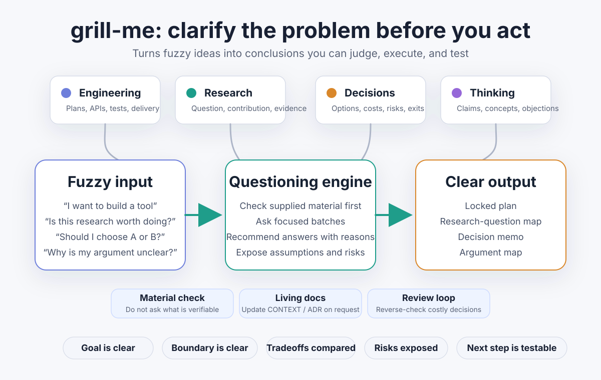

# grill-me

[English](./README-EN.md) | [中文](./README.md)

`grill-me` is an agent skill for deep clarification before action. Through structured, adaptive batches of questions, it turns fuzzy ideas into conclusions that can be judged, executed, and tested. It works across engineering plans, research ideas, life or strategy decisions, and conceptual arguments.



## Features

- Route the conversation by the intended output: engineering, academic research, decision-making, or reflective thinking.
- Ask focused batches of questions, with recommended answers and concise reasoning.
- Use supplied documents, code, notes, papers, or project context to avoid asking what can already be verified.
- Optionally maintain living documents such as `CONTEXT.md`, `CONTEXT-MAP.md`, and ADRs when the user explicitly wants documentation updated.
- Stop when the goal, boundaries, tradeoffs, risks, and next action are clear enough to decide.

## Installation

In an agent chat window (Codex/ZCode/Claude Code/OpenCode/Kimi Code, etc.), run the following command:

```text
Please install hiDaDeng/grill-me for me.
GitHub：https://github.com/hiDaDeng/grill-me
```

If you prefer a terminal:

```
npx skills add hiDaDeng/grill-me
```

## Usage

Typical agent prompt:

```text
$grill-me Help me clarify whether this research idea is worth pursuing: ...
```

Other examples:

```text
$grill-me Stress-test this product plan before I build it.
$grill-me Grill my career decision between option A and option B.
$grill-me Help me turn this vague argument into a clear position.
```

## Routes

`grill-me` chooses one main route based on the final artifact the user needs:

- **Engineering**: code, tools, systems, data pipelines, automation, architecture, verification, and delivery.
- **Academic research**: research questions, contribution, concepts, mechanisms, evidence routes, validity, and feasibility.
- **Decision-making**: career, life, strategy, resource allocation, opportunity cost, reversibility, risk, and next action.
- **Reflective thinking**: claims, concepts, value judgments, philosophical questions, argument maps, and interpretations of someone else's view.

Only the needed route file is loaded during a run, keeping the main skill compact.

## Modes

- **Read-only material check**: use provided files, code, notes, papers, or specifications as evidence; do not edit them.
- **Living documentation**: when explicitly requested, update locked terminology or decisions in context documents or ADRs.
- **Review loop**: after convergence, run a limited reverse check for high-cost, hard-to-reverse, or user-requested decisions.

## Output

The final response uses the smallest route-specific template:

- Engineering: locked plan
- Academic research: research-question map
- Decision-making: decision memo
- Reflective thinking: argument map

If the work is blocked, the output names the blocking question, why it matters, known facts, the smallest action to resolve it, and any temporary default.

## Project Structure

```text
grill-me/
├── SKILL.md
├── README.md
├── README-zh.md
├── agents/
│   └── openai.yaml
├── assets/
│   ├── adr-template.md
│   ├── context-map-template.md
│   └── context-template.md
└── references/
    ├── academic.md
    ├── adr-docs.md
    ├── context-docs.md
    ├── decision.md
    ├── docs-mode.md
    ├── engineering.md
    ├── output-templates.md
    ├── review-loop.md
    └── thinking.md
```

## File Guide

- `SKILL.md`  
  Core routing instructions for the skill.

- `README.md`  
  English project overview.

- `README-zh.md`  
  Chinese project overview.

- `agents/openai.yaml`  
  UI metadata for display name, short description, and default prompt.

- `references/engineering.md`  
  Engineering questioning route.

- `references/academic.md`  
  Academic research questioning route.

- `references/decision.md`  
  Decision-making questioning route.

- `references/thinking.md`  
  Reflective and argumentative thinking route.

- `references/docs-mode.md`  
  Rules for using supplied materials and living documents.

- `references/context-docs.md`  
  Rules for maintaining domain context documents.

- `references/adr-docs.md`  
  Rules for architecture decision records.

- `references/review-loop.md`  
  Limited review pass for converged conclusions.

- `references/output-templates.md`  
  Final response templates by route.

- `assets/*.md`  
  Reusable templates for context documents and ADRs.

## Notes

- This skill is intentionally demanding, but it should challenge ideas rather than judge the person.
- It defaults to clarification and decision support; it edits files only when the user explicitly asks for documentation maintenance or implementation.

## Acknowledgements

`grill-me` is inspired by Matt Pocock's [`skills`](https://github.com/mattpocock/skills) repository, especially its grilling-session skills. This repository is a Chinese multi-route adaptation for engineering, academic research, decision-making, and reflective thinking workflows.
