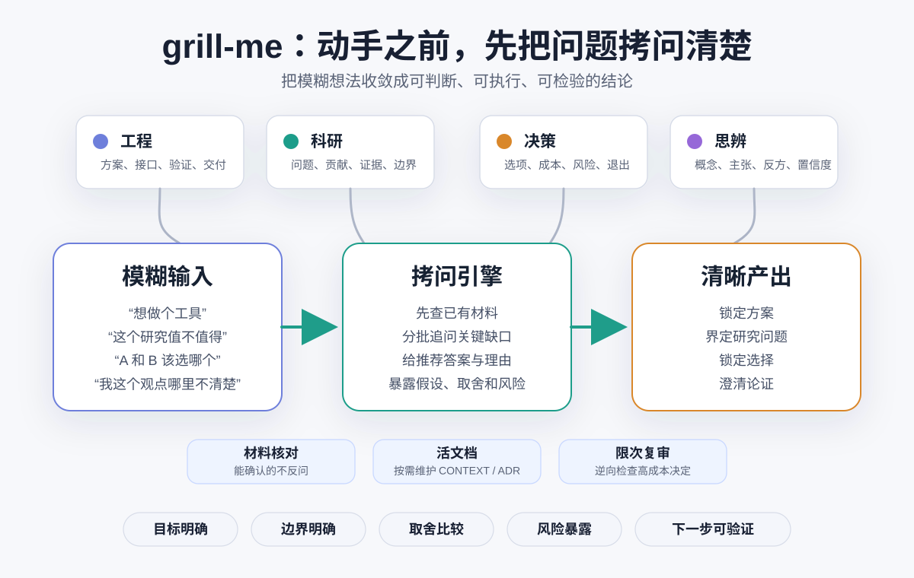

# grill-me

[English](./README-EN.md) | [中文](./README.md)

`grill-me` 是一个面向智能体的深度澄清技能。它通过结构化、分批、自适应的追问，把模糊想法拷问成可判断、可执行、可检验的结论。适用于工程方案、科研选题、人生/职业/战略决策，以及观点和概念澄清。



## 特性

- 按最终产物选择主路由：工程、科研、决策或思辨。
- 分批提出高影响问题，并给出推荐答案和简短理由。
- 优先读取用户提供的文档、代码、笔记、论文或规范，能从材料确认的事实不反问用户。
- 在用户明确要求时维护活文档，例如 `CONTEXT.md`、`CONTEXT-MAP.md` 和 ADR。
- 当目标、边界、取舍、风险和下一步足够明确时停止追问。

## 安装

仓库发布后，在 agent 对话框（Codex/ZCode/Claude Code/OpenCode/Kimi Code 等）中执行：

```text
安装 GitHub 仓库 hiDaDeng/grill-me
```
如果想用终端：

```
npx skills add hiDaDeng/grill-me
```


## 使用

常见调用方式：

```text
$grill-me 帮我判断这个研究想法是否值得推进：...
```

其他示例：

```text
$grill-me 开始做之前，帮我拷问这个产品方案。
$grill-me 帮我拷问 A 和 B 两个职业选择。
$grill-me 把这个模糊观点拷问成清楚的论证。
```

## 路由

`grill-me` 会根据用户最终需要的产物选择一个主路由：

- **工程**：代码、工具、系统、数据管道、自动化、架构、验证与交付。
- **科研**：研究问题、贡献、概念、机制、证据路线、有效性与可行性。
- **决策**：人生、职业、战略、资源分配、机会成本、可逆性、风险与下一步。
- **思辨**：观点、概念、价值判断、哲学问题、论证图，以及对他人观点的解释。

每次只加载必要路由文件，避免把全部规则塞进主技能上下文。

## 模式

- **只读核对**：默认使用材料作为证据，不改写文件。
- **活文档维护**：用户明确要求时，把已经锁定的术语或决定写入上下文文档或 ADR。
- **限次复审**：访谈收敛后，对高成本、难逆转或用户明确要求复审的结论做逆向检查。

## 输出

最终回复使用与主路由对应的最小模板：

- 工程：锁定方案
- 科研：研究问题图
- 决策：决策备忘
- 思辨：论证图

如果结论被阻塞，则输出阻塞问题、为什么关键、已知事实、获取答案的最小行动，以及答案到来前可采用的临时默认值。

## 项目结构

```text
grill-me/
├── SKILL.md
├── README.md
├── README-zh.md
├── agents/
│   └── openai.yaml
├── assets/
│   ├── adr-template.md
│   ├── context-map-template.md
│   └── context-template.md
└── references/
    ├── academic.md
    ├── adr-docs.md
    ├── context-docs.md
    ├── decision.md
    ├── docs-mode.md
    ├── engineering.md
    ├── output-templates.md
    ├── review-loop.md
    └── thinking.md
```

## 文件说明

- `SKILL.md`  
  技能主说明，负责路由选择和总体执行规则。

- `README.md`  
  英文版项目说明。

- `README-zh.md`  
  中文版项目说明。

- `agents/openai.yaml`  
  界面名称、简介与默认提示词等元数据。

- `references/engineering.md`  
  工程问题追问路由。

- `references/academic.md`  
  科研问题追问路由。

- `references/decision.md`  
  决策问题追问路由。

- `references/thinking.md`  
  思辨与论证澄清路由。

- `references/docs-mode.md`  
  使用材料和维护活文档的规则。

- `references/context-docs.md`  
  维护领域上下文文档的规则。

- `references/adr-docs.md`  
  建立和维护架构决策记录的规则。

- `references/review-loop.md`  
  对已收敛结论进行限次复审的规则。

- `references/output-templates.md`  
  各路由最终输出模板。

- `assets/*.md`  
  上下文文档和 ADR 的可复用模板。

## 说明

- 这个技能会强硬追问想法，但目标是质疑论证，不评价人格。
- 默认只做澄清和定案；只有用户明确要求维护文档或进入执行时才写文件或实施方案。

## 来源与致谢

`grill-me` 借鉴自 Matt Pocock 的 [`skills`](https://github.com/mattpocock/skills) 仓库，尤其是其中的 grilling-session 类技能。本仓库是在该思路基础上扩展出的中文多路由版本，覆盖工程、科研、决策与思辨工作流。
